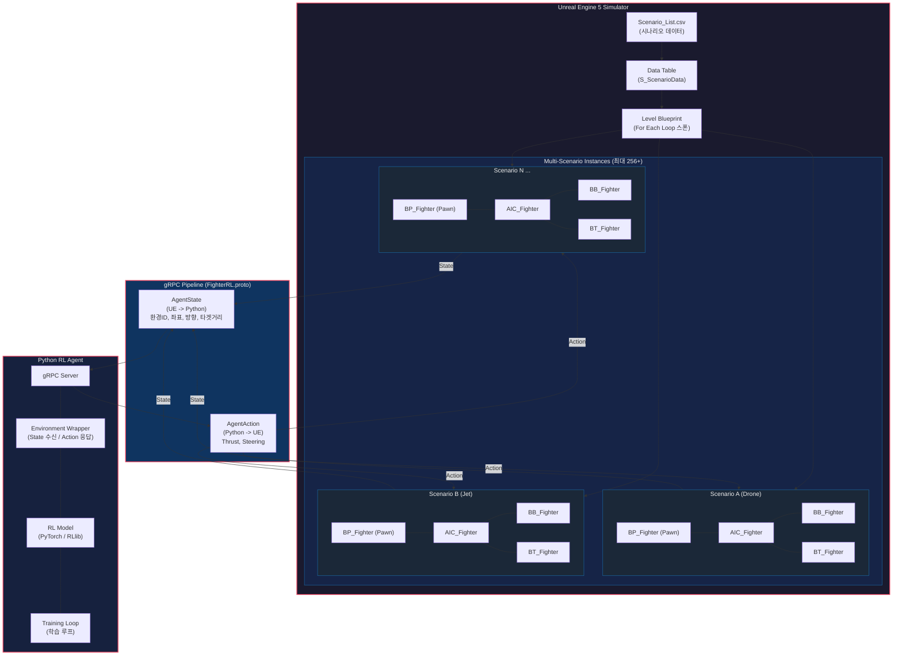
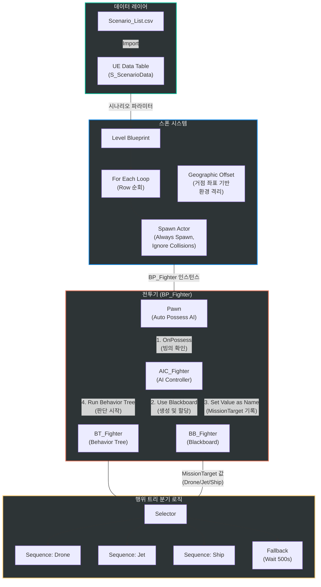
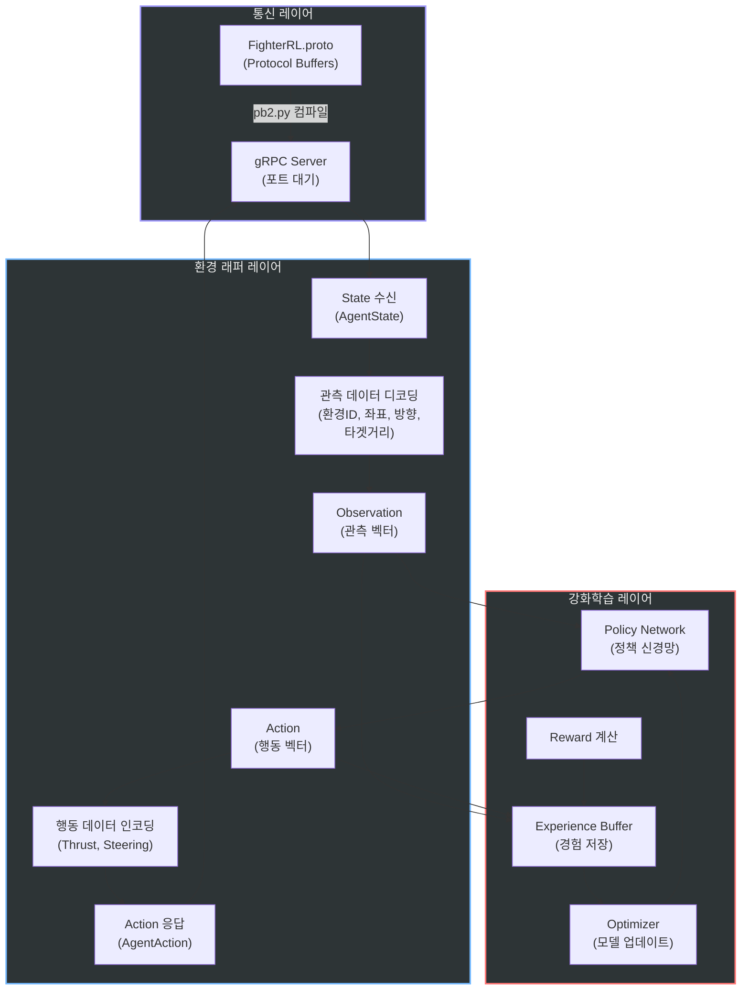
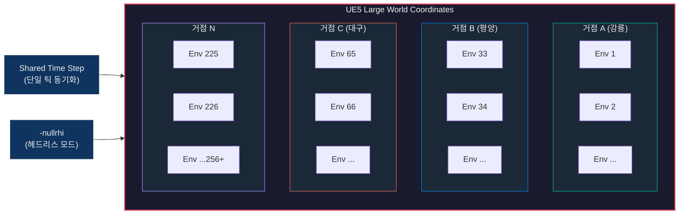
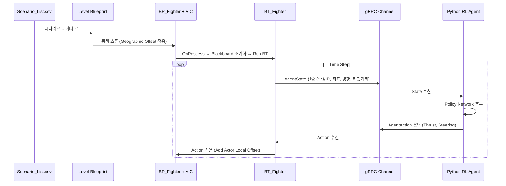

# 시스템 아키텍처 다이어그램 (System Architecture Diagram)

본 문서는 **Unreal Engine 임무 비행 시뮬레이터 & gRPC 강화학습 에이전트 파이프라인** 프로젝트의 전체 시스템 구조를 시각화합니다.

---

## 1. 전체 시스템 구조 (Full System Overview)

---

## 2. 시뮬레이터 내부 구조 (UE5 Simulator Detail)

---

## 3. 에이전트 내부 구조 (Python RL Agent Detail)

---

## 4. 대규모 병렬 실행 구조 (Geographic Offset)

---

## 5. 데이터 흐름 시퀀스 (State-Action Loop)

