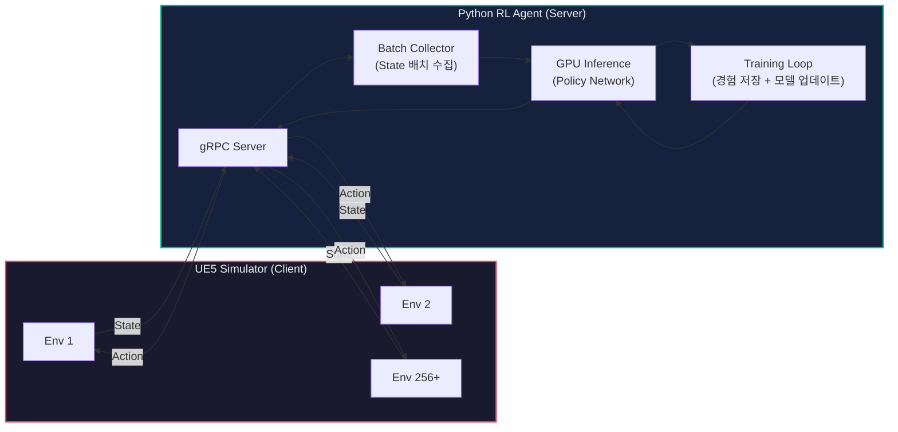
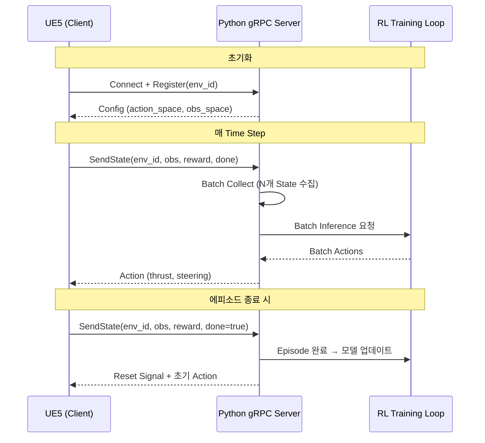

# gRPC 서버 배치 위치 분석

## 두 가지 선택지

| | Option A: **시뮬레이터(UE5) = Server** | Option B: **에이전트(Python) = Server** |
|:---|:---|:---|
| 흐름 | Python이 `Step(action)`을 호출 → UE5가 상태 반환 | UE5가 `SendState(state)`를 호출 → Python이 액션 반환 |
| RL 매핑 | `env.step()` 패러다임과 일치 | UE5가 Tick 단위로 Python에 요청 |
| 제어 주체 | Python이 시뮬레이션 속도를 제어 | UE5 Tick이 시뮬레이션 속도를 주도 |

---

## 1. 학습 효율성

### Option A (UE5 Server)
- Python이 `env.step(action)` → `(state, reward, done)` 형태로 호출하므로 **표준 RL Gym 인터페이스와 자연스럽게 매핑**
- 그러나 UE5의 게임 루프를 **매 스텝마다 일시 정지(lockstep)**시켜야 하므로 구현 복잡도가 높음
- 256개 환경 각각에 대해 개별 RPC를 호출하면 **순차적 병목** 발생

### Option B (Python Server) — 우위
- UE5가 매 Tick마다 256개 환경의 State를 Python 서버로 전송
- Python 서버가 **256개 State를 배치(Batch)로 모아 GPU에서 한 번에 추론** → 연산 효율 극대화
- 경험 버퍼(Experience Buffer)가 서버 프로세스 내에 존재하므로 **IPC 없이 즉시 학습 업데이트** 가능
- 비동기 학습(A3C) 또는 동기 학습(PPO) 모두 자연스럽게 구현 가능

> **결론:** 대규모 병렬 학습에서는 **배치 추론**이 핵심이며, 이는 Python Server 구조에서만 효율적으로 구현 가능합니다.

---

## 2. 시스템 안정성

### Option A (UE5 Server) — 위험 요소
- UE5에 gRPC C++ 라이브러리를 직접 빌드/링크해야 함 → **엔진 버전 업그레이드 시 호환성 파손** 위험
- UE5 크래시 = gRPC 서버 다운 = 학습 중단 + 경험 데이터 손실
- UE5 lockstep 구현 시 게임 루프 일시 정지 로직이 복잡하며, **데드락** 가능성 존재

### Option B (Python Server) — 우위
- Python gRPC는 `grpcio` 패키지로 즉시 사용 가능, **성숙하고 안정적**
- **분리된 생명주기:** UE5가 크래시해도 Python 서버/학습 데이터는 보존
- Python 서버 재시작이 수 초 이내 → UE5 재시작(수십 초~분)보다 훨씬 빠른 복구
- UE5 측은 단순 gRPC **클라이언트**(HTTP/2 요청)만 구현하면 되므로 플러그인 의존성 최소화

> **결론:** 장기 학습(수 시간~수일) 안정성을 위해 **가벼운 쪽(Python)을 서버로, 불안정한 쪽(UE5)을 클라이언트로** 두는 것이 합리적입니다.

---

## 3. 사용 편의성

### Option A (UE5 Server) — 단점
- UE5 C++ 프로젝트에 protobuf/gRPC 빌드 체인 통합 필요 (CMake, 크로스 컴파일 등)
- `.proto` 변경 시 UE5 프로젝트 전체 리빌드 필요
- 디버깅: UE5 C++ gRPC 호출 추적은 상당히 어려움

### Option B (Python Server) — 우위
- Python gRPC 서버 구현: **~30줄 코드**로 동작
- `.proto` 변경 시 `python -m grpc_tools.protoc` 한 줄로 재컴파일
- 디버깅/로깅/모니터링 도구가 풍부 (tensorboard, wandb 등과 직접 연동)
- ML 연구자가 **모델만 교체**하면서 실험 반복 가능 (UE5 재시작 불필요)

> **결론:** 개발 반복 속도와 ML 연구자의 워크플로우 측면에서 Python Server가 압도적으로 편리합니다.

---

## 4. 확장성

### Option A (UE5 Server) — 한계
- UE5 인스턴스마다 gRPC 서버 포트를 별도 관리해야 함
- 분산 학습 시 여러 UE5 서버 주소를 Python에서 관리 → 복잡도 증가
- 클라우드 배포 시 UE5 서버 컨테이너화가 어려움

### Option B (Python Server) — 우위
- **1개 Python 서버가 N개 UE5 클라이언트를 수용** → 포트/주소 관리 단순화
- 부하 증가 시 Python 서버만 스케일업(GPU 추가) 또는 스케일아웃(서버 분리)
- 여러 물리 머신의 UE5 인스턴스가 **중앙 Python 서버에 접속**하는 분산 학습 구조로 자연스럽게 확장
- 클라우드 GPU 서버에 Python을 배포하고, 로컬/온프레미스에서 UE5를 구동하는 **하이브리드 배포** 가능

> **결론:** "서버는 하나, 클라이언트는 여럿"이라는 자연스러운 구조가 대규모 확장에 적합합니다.

---

## 5. 업계 사례 참고

| 프레임워크 | 서버 위치 | 구조 |
|:---|:---|:---|
| **Unity ML-Agents** | Python (Trainer) | Unity가 Python Trainer에 접속하여 State 전송 / Action 수신 |
| **NVIDIA Isaac Sim** | Python | Python이 시뮬레이션을 직접 구동하거나 원격 제어 |
| **OpenAI Gym (Remote)** | Environment | Agent가 Environment 서버를 호출 (소규모 단일 환경 기준) |
| **Ray/RLlib + UE** | Python (Ray) | UE를 Worker로 두고 Ray가 중앙 관리 |

> 대규모 병렬 RL 학습 시 **거의 모든 산업 프레임워크가 Python 측을 중앙 서버/트레이너로** 배치합니다.

---

## 최종 권고: Python 에이전트 측 gRPC Server

### 권고 데이터 흐름

### 요약

| 기준 | UE5 Server | Python Server |
|:---|:---:|:---:|
| 학습 효율성 (배치 추론) | 어려움 | **우수** |
| 시스템 안정성 | 취약 | **우수** |
| 사용 편의성 | 복잡 | **간편** |
| 확장성 (256+) | 제한적 | **우수** |
| 업계 표준 부합 | 소규모만 | **표준** |

> **Python 에이전트 측을 gRPC Server로 배치**하는 것을 권고합니다.
